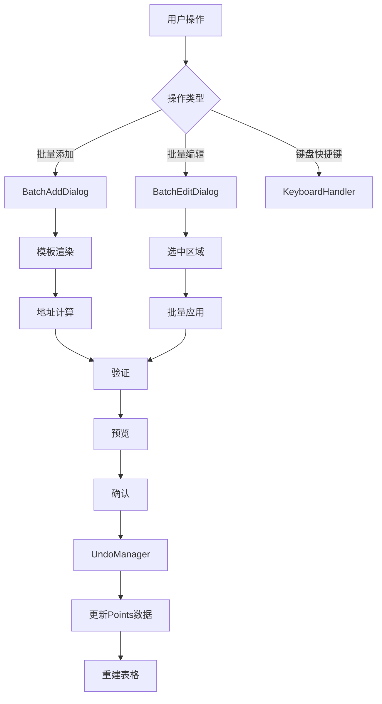

# Design Document: Points Table UX Enhancement

## Overview

本设计文档描述了通讯点位表格（Points Table）用户体验增强的技术实现方案。该功能旨在提升用户在配置大量通讯点位时的效率，通过优化批量添加、批量编辑、界面布局等核心交互，使用户能够更快速、更准确地完成点位配置工作。

### Design Goals

1. **提升批量操作效率** - 支持从任意位置插入点位，使用模板快速生成规律性数据
2. **增强数据类型支持** - 添加64位整型和浮点型支持，满足更广泛的应用场景
3. **简化用户界面** - 分离配置和运行功能，减少界面干扰，提升专注度
4. **智能化辅助** - 自动推断地址、验证范围、实时预览，减少人为错误
5. **提供撤销能力** - 支持批量操作撤销，降低误操作风险

### Key Features

- 从任意行位置批量添加点位
- 模板化变量名称生成（支持 `{{number}}` 占位符）
- 64位数据类型支持（Int64、UInt64、Float64）
- 快速区域选择和批量编辑
- 简化的界面布局（配置/运行分离）
- 智能地址推断和验证
- 实时预览批量操作结果
- 键盘快捷键支持
- 批量操作撤销功能

## Architecture

### Component Structure

```
src/comm/
├── pages/
│   ├── Points.vue (重构) - 点位配置页面
│   └── PointsRun.vue (新增) - 点位运行页面
├── components/
│   ├── BatchAddDialog.vue (重构) - 批量添加对话框
│   ├── BatchEditDialog.vue (新增) - 批量编辑对话框
│   └── revogrid/ - 表格编辑器组件
├── services/
│   ├── batchAdd.ts (扩展) - 批量添加逻辑
│   ├── batchEdit.ts (新增) - 批量编辑逻辑
│   ├── address.ts (扩展) - 地址计算和验证
│   ├── dataTypes.ts (新增) - 数据类型定义和工具
│   └── undoRedo.ts (新增) - 撤销/重做管理
└── api.ts (扩展) - API类型定义
```

### Data Flow




## Components and Interfaces

### 1. 数据类型扩展

#### DataType 类型定义（扩展）

```typescript
// src/comm/api.ts
export type DataType =
  | "Bool"
  | "Int16"
  | "UInt16"
  | "Int32"
  | "UInt32"
  | "Int64"    // 新增
  | "UInt64"   // 新增
  | "Float32"
  | "Float64"  // 新增
  | "Unknown";
```

#### 数据类型工具函数

```typescript
// src/comm/services/dataTypes.ts
export interface DataTypeInfo {
  name: DataType;
  displayName: string;
  registerSpan: number;  // 占用寄存器数量
  byteSize: number;      // 字节大小
  category: 'integer' | 'float' | 'boolean';
  signed: boolean;
}

export function getDataTypeInfo(dataType: DataType): DataTypeInfo;
export function getRegisterSpan(dataType: DataType): number;
export function isValidForArea(dataType: DataType, area: RegisterArea): boolean;
```

### 2. 批量添加对话框（重构）

#### BatchAddDialog 组件接口

```typescript
interface BatchAddDialogProps {
  visible: boolean;
  profile: ConnectionProfile | null;
  lastRow: PointRow | null;
  selectedRowIndex: number;
  insertMode: 'append' | 'afterSelection';
}

interface BatchAddDialogEmits {
  (e: 'update:visible', value: boolean): void;
  (e: 'confirm', result: BatchAddResult): void;
}

interface BatchAddResult {
  points: CommPoint[];
  insertIndex: number;
  preview: BatchAddPreviewRow[];
}
```

#### 批量添加模板参数

```typescript
interface BatchAddTemplate {
  count: number;                    // 生成数量 (1-500)
  startAddressHuman: string;        // 起始地址（如 "40001"）
  dataType: DataType;               // 数据类型
  byteOrder: ByteOrder32;           // 字节序
  hmiNameTemplate: string;          // 变量名称模板（支持 {{number}}, {{addr}}）
  scaleTemplate: string;            // 缩放倍数模板（支持 {{number}}）
  insertMode: 'append' | 'afterSelection';
}
```


### 3. 批量编辑对话框（新增）

#### BatchEditDialog 组件接口

```typescript
interface BatchEditDialogProps {
  visible: boolean;
  selectedRows: PointRow[];
  selectedCount: number;
}

interface BatchEditDialogEmits {
  (e: 'update:visible', value: boolean): void;
  (e: 'confirm', edits: BatchEditParams): void;
}

interface BatchEditParams {
  dataType?: DataType;           // 可选：批量设置数据类型
  byteOrder?: ByteOrder32;       // 可选：批量设置字节序
  scaleExpression?: string;      // 可选：缩放倍数表达式
  affectedRowKeys: string[];     // 受影响的行键
}

interface BatchEditPreview {
  totalRows: number;
  fieldsToUpdate: string[];
  estimatedChanges: number;
}
```

### 4. 撤销/重做管理器（新增）

#### UndoManager 接口

```typescript
// src/comm/services/undoRedo.ts
export interface UndoableAction {
  type: 'batch-add' | 'batch-edit' | 'delete-rows';
  timestamp: number;
  description: string;
  undo: () => void;
  redo: () => void;
}

export class UndoManager {
  private history: UndoableAction[] = [];
  private currentIndex: number = -1;
  private maxHistorySize: number = 20;

  canUndo(): boolean;
  canRedo(): boolean;
  undo(): void;
  redo(): void;
  push(action: UndoableAction): void;
  clear(): void;
  getHistory(): UndoableAction[];
}
```

### 5. 地址计算服务（扩展）

#### 地址计算函数扩展

```typescript
// src/comm/services/address.ts

// 扩展：支持64位数据类型的步长计算
export function spanForArea(area: RegisterArea, dataType: DataType): number | null {
  if (area === "Holding" || area === "Input") {
    if (dataType === "Int16" || dataType === "UInt16") return 1;
    if (dataType === "Int32" || dataType === "UInt32" || dataType === "Float32") return 2;
    if (dataType === "Int64" || dataType === "UInt64" || dataType === "Float64") return 4;  // 新增
    return null;
  }
  if (area === "Coil" || area === "Discrete") {
    if (dataType === "Bool") return 1;
    return null;
  }
  return null;
}

// 新增：智能推断下一个地址
export function inferNextAddress(
  lastRow: PointRow | null,
  profile: ConnectionProfile
): string;

// 新增：验证地址范围
export function validateAddressRange(
  startAddress: number,
  count: number,
  dataType: DataType,
  profile: ConnectionProfile
): { ok: true } | { ok: false; message: string };
```


### 6. 批量编辑服务（新增）

#### 批量编辑逻辑

```typescript
// src/comm/services/batchEdit.ts

export interface BatchEditRequest {
  rows: PointRow[];
  dataType?: DataType;
  byteOrder?: ByteOrder32;
  scaleExpression?: string;
}

export interface BatchEditResult {
  edits: Array<{
    rowIndex: number;
    pointKey: string;
    changes: Partial<CommPoint>;
  }>;
  totalChanges: number;
}

export function computeBatchEdits(request: BatchEditRequest): BatchEditResult;

export function applyBatchEdits(
  points: CommPoint[],
  edits: BatchEditResult
): CommPoint[];
```

### 7. 键盘快捷键管理

#### KeyboardShortcuts 接口

```typescript
// src/comm/composables/useKeyboardShortcuts.ts

export interface KeyboardShortcut {
  key: string;
  ctrl?: boolean;
  shift?: boolean;
  alt?: boolean;
  handler: () => void;
  description: string;
}

export function useKeyboardShortcuts(shortcuts: KeyboardShortcut[]): {
  register: () => void;
  unregister: () => void;
};
```

## Data Models

### 扩展的 CommPoint 接口

```typescript
// 现有接口保持不变，但需要支持新的数据类型
export interface CommPoint {
  pointKey: string;
  hmiName: string;
  dataType: DataType;  // 现在包含 Int64, UInt64, Float64
  byteOrder: ByteOrder32;
  channelName: string;
  addressOffset?: number;
  scale: number;
}
```

### 撤销历史记录

```typescript
export interface UndoHistoryEntry {
  action: UndoableAction;
  timestamp: number;
  canUndo: boolean;
  canRedo: boolean;
}
```

### 批量操作状态

```typescript
export interface BatchOperationState {
  isProcessing: boolean;
  progress: number;
  totalItems: number;
  currentItem: number;
  errors: string[];
}
```


## Correctness Properties

*A property is a characteristic or behavior that should hold true across all valid executions of a system—essentially, a formal statement about what the system should do. Properties serve as the bridge between human-readable specifications and machine-verifiable correctness guarantees.*

### Property 1: 模板变量名称生成的一致性

*For any* 变量名称模板和生成数量 N，生成的变量名称应该按照模板规则递增，且每个名称都是唯一的。

**Validates: Requirements 2.1, 2.2**

### Property 2: 地址递增计算的正确性

*For any* 起始地址、数据类型和生成数量，生成的地址序列应该根据数据类型的寄存器步长正确递增，且不应有重复地址。

**Validates: Requirements 2.3, 2.4, 2.5, 2.6, 2.7**

### Property 3: 64位数据类型的步长计算

*For any* 64位数据类型（Int64、UInt64、Float64），计算的寄存器步长应该始终为 4。

**Validates: Requirements 3.4**

### Property 4: 批量添加的数据类型一致性

*For any* 批量添加操作，所有生成的点位应该具有相同的数据类型，且该类型与用户选择的类型一致。

**Validates: Requirements 2.8**

### Property 5: 批量添加的字节序一致性

*For any* 批量添加操作，所有生成的点位应该具有相同的字节序，且该字节序与用户选择的字节序一致。

**Validates: Requirements 2.9**

### Property 6: 批量添加的缩放倍数一致性

*For any* 批量添加操作，所有生成的点位应该具有相同的缩放倍数，且该倍数与用户输入的倍数一致。

**Validates: Requirements 2.10**

### Property 7: 地址范围验证的正确性

*For any* 批量添加操作，如果生成的任何地址超出连接配置的地址范围，系统应该检测到并返回错误。

**Validates: Requirements 3.6, 6.2, 6.4**

### Property 8: 地址与数据类型的匹配性

*For any* 地址和数据类型组合，如果数据类型不适用于该地址区域（如在 Coil 区域使用 Int32），系统应该检测到并返回错误。

**Validates: Requirements 6.3**

### Property 9: 批量编辑的数据类型应用

*For any* 选中的行集合和目标数据类型，批量编辑操作应该将该数据类型应用到所有选中的行。

**Validates: Requirements 4.5**

### Property 10: 批量编辑的字节序应用

*For any* 选中的行集合和目标字节序，批量编辑操作应该将该字节序应用到所有选中的行。

**Validates: Requirements 4.6**

### Property 11: 批量编辑的缩放倍数应用

*For any* 选中的行集合和目标缩放倍数，批量编辑操作应该将该倍数应用到所有选中的行。

**Validates: Requirements 4.7**

### Property 12: 撤销操作的状态恢复

*For any* 批量操作，执行撤销后的状态应该与操作前的状态完全一致。

**Validates: Requirements 9.3**

### Property 13: 地址自动推断的正确性

*For any* 上一行点位数据，自动推断的下一个地址应该等于上一行地址加上该行数据类型的寄存器步长。

**Validates: Requirements 1.4, 6.1**

### Property 14: 预览数据的一致性

*For any* 批量添加参数，预览生成的数据应该与实际确认后生成的数据完全一致。

**Validates: Requirements 7.1, 7.2**

### Property 15: 批量操作的原子性

*For any* 批量操作，要么所有修改都成功应用，要么在发生错误时不应用任何修改（保持原状态）。

**Validates: Requirements 4.8**


## Error Handling

### 验证错误

```typescript
export type ValidationErrorKind =
  | 'EMPTY_ADDRESS'           // 地址为空
  | 'INVALID_ADDRESS_FORMAT'  // 地址格式无效
  | 'ADDRESS_OUT_OF_RANGE'    // 地址超出范围
  | 'ADDRESS_AREA_MISMATCH'   // 地址区域不匹配
  | 'DATATYPE_AREA_MISMATCH'  // 数据类型与区域不匹配
  | 'EMPTY_HMI_NAME'          // 变量名称为空
  | 'INVALID_SCALE'           // 缩放倍数无效
  | 'TEMPLATE_SYNTAX_ERROR'   // 模板语法错误
  | 'COUNT_OUT_OF_RANGE';     // 数量超出范围

export interface ValidationError {
  kind: ValidationErrorKind;
  message: string;
  field?: string;
  value?: unknown;
  suggestion?: string;
}
```

### 错误处理策略

1. **输入验证** - 在用户输入时进行实时验证，提供即时反馈
2. **批量验证** - 在确认批量操作前验证所有生成的数据
3. **友好提示** - 提供具体的错误原因和修复建议
4. **防御性编程** - 对所有外部输入进行验证，避免运行时错误
5. **错误恢复** - 在发生错误时保持系统状态一致，不产生部分修改

### 错误消息示例

```typescript
const ERROR_MESSAGES: Record<ValidationErrorKind, (context: any) => string> = {
  ADDRESS_OUT_OF_RANGE: (ctx) => 
    `地址 ${ctx.address} 超出范围。有效范围：${ctx.min} - ${ctx.max}`,
  DATATYPE_AREA_MISMATCH: (ctx) => 
    `数据类型 ${ctx.dataType} 不适用于 ${ctx.area} 区域。建议使用：${ctx.suggested.join(', ')}`,
  TEMPLATE_SYNTAX_ERROR: (ctx) => 
    `模板语法错误：${ctx.template}。支持的占位符：{{number}}, {{addr}}`,
  // ... 其他错误消息
};
```

## Testing Strategy

### 单元测试

单元测试用于验证具体的函数和组件行为：

1. **数据类型工具函数测试**
   - 测试 `getRegisterSpan()` 对所有数据类型返回正确的步长
   - 测试 `isValidForArea()` 正确判断类型与区域的兼容性

2. **地址计算函数测试**
   - 测试 `spanForArea()` 对64位类型返回步长4
   - 测试 `inferNextAddress()` 正确推断下一个地址
   - 测试 `validateAddressRange()` 正确检测越界

3. **模板渲染测试**
   - 测试 `{{number}}` 占位符正确替换为递增序号
   - 测试 `{{addr}}` 占位符正确替换为地址
   - 测试模板语法错误的检测

4. **批量编辑逻辑测试**
   - 测试 `computeBatchEdits()` 正确计算编辑操作
   - 测试 `applyBatchEdits()` 正确应用编辑

5. **撤销管理器测试**
   - 测试 `UndoManager.push()` 正确记录操作
   - 测试 `UndoManager.undo()` 正确恢复状态
   - 测试历史记录大小限制

### 属性测试

属性测试用于验证通用的正确性属性，使用随机生成的输入：

1. **模板生成属性测试**
   - 配置：最少100次迭代
   - 生成器：随机模板字符串、随机数量(1-500)
   - 验证：生成的名称符合模板规则且唯一

2. **地址递增属性测试**
   - 配置：最少100次迭代
   - 生成器：随机起始地址、随机数据类型、随机数量
   - 验证：地址序列正确递增且无重复

3. **批量操作一致性测试**
   - 配置：最少100次迭代
   - 生成器：随机点位数据、随机批量参数
   - 验证：所有生成点位的属性一致

4. **撤销恢复属性测试**
   - 配置：最少100次迭代
   - 生成器：随机操作序列
   - 验证：撤销后状态与操作前一致

### 集成测试

集成测试验证组件之间的交互：

1. **批量添加流程测试**
   - 打开对话框 → 输入参数 → 预览 → 确认 → 验证结果

2. **批量编辑流程测试**
   - 选中行 → 打开对话框 → 修改参数 → 确认 → 验证结果

3. **撤销/重做流程测试**
   - 执行操作 → 撤销 → 验证恢复 → 重做 → 验证重新应用

4. **键盘快捷键测试**
   - 模拟键盘事件 → 验证对应操作触发

### 测试工具和框架

- **单元测试框架**: Vitest
- **属性测试库**: fast-check
- **组件测试**: @vue/test-utils
- **E2E测试**: Playwright (可选)


## Implementation Details

### 1. 页面重构：配置与运行分离

#### Points.vue（配置页面）

保留内容：
- 点位表格（Grid组件）
- 连接选择下拉框
- 批量添加按钮
- 批量编辑按钮
- 删除选中行按钮
- 保存/加载按钮
- 撤销/重做按钮

移除内容：
- 运行控制按钮（开始运行、停止、重启）
- 运行状态标签（runId、状态、轮询间隔）
- 运行统计信息（Total、OK、Timeout等）
- 运行日志折叠面板
- 高级工具折叠面板（Fill/Plan/诊断）

#### PointsRun.vue（新增运行页面）

包含内容：
- 连接选择（只读显示）
- 运行控制按钮（开始、停止、重启）
- 运行状态显示
- 轮询间隔设置
- 实时数据表格（只读）
- 运行统计信息
- 运行日志
- 诊断工具

### 2. 批量添加对话框重构

#### 改进点

1. **智能默认值**
   - 起始地址：自动推断为上一行的下一个地址
   - 数据类型：继承上一行的数据类型
   - 字节序：继承上一行的字节序
   - 缩放倍数：继承上一行的缩放倍数

2. **实时预览**
   - 参数变化时立即更新预览
   - 显示前10行的完整信息
   - 显示错误信息（如果有）

3. **模板增强**
   - 支持 `{{number}}` 占位符（从1开始递增）
   - 支持 `{{addr}}` 占位符（当前行的地址）
   - 提供模板示例和说明

4. **验证增强**
   - 实时验证地址范围
   - 实时验证数据类型兼容性
   - 显示具体的错误原因和建议

### 3. 批量编辑对话框（新增）

#### 功能设计

```vue
<template>
  <el-dialog v-model="visible" title="批量编辑" width="600px">
    <el-alert type="info" :closable="false">
      将对选中的 {{ selectedCount }} 行进行批量编辑
    </el-alert>

    <el-form label-width="120px" style="margin-top: 20px">
      <el-form-item label="数据类型">
        <el-select v-model="dataType" placeholder="不修改" clearable>
          <el-option v-for="type in DATA_TYPES" :key="type" :value="type" />
        </el-select>
      </el-form-item>

      <el-form-item label="字节序">
        <el-select v-model="byteOrder" placeholder="不修改" clearable>
          <el-option v-for="order in BYTE_ORDERS" :key="order" :value="order" />
        </el-select>
      </el-form-item>

      <el-form-item label="缩放倍数">
        <el-input v-model="scaleExpression" placeholder="不修改（可使用表达式）" />
        <div class="hint">支持：固定值（如 2）或表达式（如 {{x}}*10）</div>
      </el-form-item>
    </el-form>

    <el-alert v-if="preview" type="success" :closable="false">
      预计修改 {{ preview.totalRows }} 行，{{ preview.estimatedChanges }} 个字段
    </el-alert>

    <template #footer>
      <el-button @click="visible = false">取消</el-button>
      <el-button type="primary" @click="confirm">确认修改</el-button>
    </template>
  </el-dialog>
</template>
```

### 4. 撤销/重做实现

#### 状态快照策略

```typescript
// 使用深拷贝保存操作前的状态
function createSnapshot(points: CommPoint[]): CommPoint[] {
  return JSON.parse(JSON.stringify(points));
}

// 批量添加的撤销操作
function createBatchAddUndoAction(
  points: Ref<PointsV1>,
  addedKeys: string[]
): UndoableAction {
  const beforeSnapshot = createSnapshot(points.value.points);
  
  return {
    type: 'batch-add',
    timestamp: Date.now(),
    description: `添加了 ${addedKeys.length} 个点位`,
    undo: () => {
      points.value.points = beforeSnapshot;
    },
    redo: () => {
      // 重做逻辑
    }
  };
}
```

### 5. 键盘快捷键实现

```typescript
// src/comm/composables/useKeyboardShortcuts.ts
export function useKeyboardShortcuts(context: {
  onBatchAdd: () => void;
  onBatchEdit: () => void;
  onDelete: () => void;
  onUndo: () => void;
  onRedo: () => void;
}) {
  const handleKeyDown = (e: KeyboardEvent) => {
    // Ctrl+B: 批量添加
    if (e.ctrlKey && e.key === 'b') {
      e.preventDefault();
      context.onBatchAdd();
    }
    
    // Ctrl+E: 批量编辑
    if (e.ctrlKey && e.key === 'e') {
      e.preventDefault();
      context.onBatchEdit();
    }
    
    // Delete: 删除选中行
    if (e.key === 'Delete') {
      e.preventDefault();
      context.onDelete();
    }
    
    // Ctrl+Z: 撤销
    if (e.ctrlKey && e.key === 'z' && !e.shiftKey) {
      e.preventDefault();
      context.onUndo();
    }
    
    // Ctrl+Shift+Z 或 Ctrl+Y: 重做
    if ((e.ctrlKey && e.shiftKey && e.key === 'z') || (e.ctrlKey && e.key === 'y')) {
      e.preventDefault();
      context.onRedo();
    }
  };

  onMounted(() => {
    window.addEventListener('keydown', handleKeyDown);
  });

  onUnmounted(() => {
    window.removeEventListener('keydown', handleKeyDown);
  });
}
```

### 6. 64位数据类型支持

#### 前端类型定义更新

```typescript
// src/comm/api.ts
export type DataType =
  | "Bool"
  | "Int16"
  | "UInt16"
  | "Int32"
  | "UInt32"
  | "Int64"    // 新增
  | "UInt64"   // 新增
  | "Float32"
  | "Float64"  // 新增
  | "Unknown";

// 更新常量数组
const DATA_TYPES: DataType[] = [
  "Bool",
  "Int16",
  "UInt16",
  "Int32",
  "UInt32",
  "Int64",    // 新增
  "UInt64",   // 新增
  "Float32",
  "Float64"   // 新增
];
```

#### 后端类型定义更新（Rust）

```rust
// src-tauri/src/comm/model.rs
#[derive(Debug, Clone, Copy, PartialEq, Eq, Serialize, Deserialize)]
#[serde(rename_all = "PascalCase")]
pub enum DataType {
    Bool,
    Int16,
    UInt16,
    Int32,
    UInt32,
    Int64,    // 新增
    UInt64,   // 新增
    Float32,
    Float64,  // 新增
    Unknown,
}

impl DataType {
    pub fn register_span(&self) -> Option<usize> {
        match self {
            DataType::Bool => Some(1),
            DataType::Int16 | DataType::UInt16 => Some(1),
            DataType::Int32 | DataType::UInt32 | DataType::Float32 => Some(2),
            DataType::Int64 | DataType::UInt64 | DataType::Float64 => Some(4),  // 新增
            DataType::Unknown => None,
        }
    }
}
```

## Performance Considerations

### 优化策略

1. **虚拟滚动** - 表格使用虚拟滚动，支持大量数据（1000+行）
2. **防抖处理** - 实时预览使用防抖，避免频繁计算
3. **增量更新** - 批量操作后只更新受影响的行
4. **懒加载** - 对话框组件按需加载
5. **内存管理** - 撤销历史限制为20条，避免内存泄漏

### 性能指标

- 批量添加500行：< 500ms
- 批量编辑100行：< 200ms
- 撤销操作：< 100ms
- 预览更新：< 50ms（防抖后）
- 表格渲染：< 1s（1000行）

## Security Considerations

### 输入验证

1. **数量限制** - 批量添加数量限制在1-500之间
2. **地址验证** - 严格验证地址格式和范围
3. **模板验证** - 防止模板注入攻击
4. **表达式验证** - 缩放表达式只支持安全的数学运算

### 数据完整性

1. **原子操作** - 批量操作要么全部成功，要么全部失败
2. **状态一致性** - 撤销操作保证状态完全恢复
3. **数据验证** - 保存前验证所有数据的完整性

## Accessibility

### 键盘导航

- 所有功能都可通过键盘访问
- 提供键盘快捷键
- 支持Tab键在表单字段间导航

### 屏幕阅读器

- 为按钮和输入框提供aria-label
- 为错误消息提供aria-live区域
- 为对话框提供适当的role属性

### 视觉辅助

- 错误消息使用红色边框和图标
- 成功消息使用绿色提示
- 高对比度模式支持

## Migration Strategy

### 向后兼容

1. **数据格式** - 保持现有的JSON格式不变
2. **API接口** - 扩展而不是替换现有接口
3. **渐进增强** - 新功能作为可选增强，不影响现有功能

### 迁移步骤

1. **Phase 1**: 添加64位数据类型支持（后端+前端）
2. **Phase 2**: 重构批量添加对话框
3. **Phase 3**: 实现批量编辑对话框
4. **Phase 4**: 实现撤销/重做功能
5. **Phase 5**: 分离配置和运行页面
6. **Phase 6**: 添加键盘快捷键

### 数据迁移

现有项目数据无需迁移，新的数据类型只在用户主动选择时使用。

